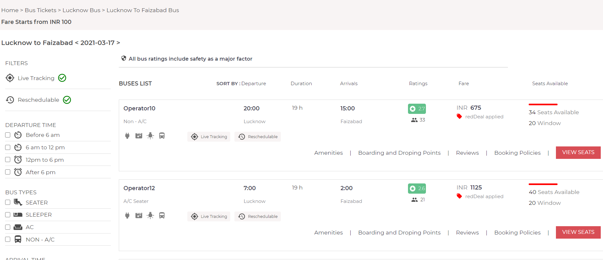
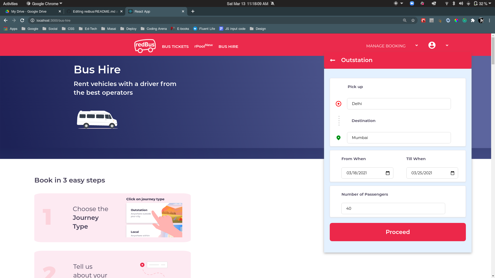

# 🚌 Redbus Clone — Full DevOps Implementation

> A production-grade deployment of a MERN stack bus booking platform, containerized with Docker and deployed on Kubernetes using a complete GitOps pipeline with ArgoCD.

**Built & DevOps-implemented by [Harshmeet Singh](https://github.com/harshXprojects)**


---

## 📌 Project Overview

This project takes an existing MERN stack Redbus clone and wraps it with a **complete DevOps lifecycle** — from Dockerization to Kubernetes orchestration to a fully automated GitOps CD pipeline. The goal is to showcase real-world infrastructure skills applicable to cloud and DevOps engineering roles.

### 🔧 What I Built (DevOps Layer)

| Layer | Tools Used |
|-------|-----------|
| Containerization | Docker, Docker Compose |
| Container Orchestration | Kubernetes (Deployments, StatefulSet, Services, Ingress, PVC) |
| GitOps / CD | ArgoCD |
| CI/CD Pipeline | GitHub Actions |
| Image Registry | Docker Hub |
| Secrets Management | Kubernetes Secrets |

---

## 🏗️ Architecture

```
                        ┌─────────────────────────────────────┐
                        │         GitHub Repository            │
                        │   (Source of Truth for GitOps)       │
                        └────────────┬────────────────────────┘
                                     │  git push triggers
                        ┌────────────▼────────────────────────┐
                        │       GitHub Actions CI/CD           │
                        │  Test → Build → Push → Update Tags   │
                        └────────────┬────────────────────────┘
                                     │  image tag update committed
                        ┌────────────▼────────────────────────┐
                        │            ArgoCD                    │
                        │  Watches k8s/ → Syncs to Cluster     │
                        └────────────┬────────────────────────┘
                                     │  applies manifests
                        ┌────────────▼────────────────────────┐
                        │       Kubernetes Cluster             │
                        │                                      │
                        │  ┌──────────┐   ┌──────────────┐    │
                        │  │ Frontend │   │   Backend    │    │
                        │  │ (React)  │──▶│ (Node/Express│    │
                        │  │ x2 pods  │   │  x2 pods)    │    │
                        │  └──────────┘   └──────┬───────┘    │
                        │                         │            │
                        │              ┌──────────▼───────┐   │
                        │              │  MongoDB          │   │
                        │              │  StatefulSet      │   │
                        │              │  + PVC (5Gi)      │   │
                        │              └──────────────────┘   │
                        └─────────────────────────────────────┘
```

---

## 📁 Repository Structure

```
redbus/
├── front-end-redbus/          # React frontend
│   └── Dockerfile
├── back-end-redbus/           # Node.js/Express API
│   └── Dockerfile
├── k8s/                       # ← Kubernetes manifests
│   ├── namespace.yaml
│   ├── configmap.yaml
│   ├── secret.yaml
│   ├── ingress.yaml
│   ├── mongodb/
│   │   ├── pvc.yaml           # Persistent storage for MongoDB
│   │   ├── statefulset.yaml   # StatefulSet (not Deployment — DB needs stable identity)
│   │   └── service.yaml       # Headless service for DNS
│   ├── backend/
│   │   ├── deployment.yaml    # 2 replicas, rolling update
│   │   └── service.yaml       # ClusterIP
│   └── frontend/
│       ├── deployment.yaml    # 2 replicas, rolling update
│       └── service.yaml       # ClusterIP
├── argocd/
│   └── application.yaml       # ← ArgoCD app definition
├── .github/
│   └── workflows/
│       └── ci-cd.yaml         # ← GitHub Actions pipeline
├── docker-compose.yml         # Local development stack
└── README.md
```

---

## 🔄 CI/CD Pipeline

The GitHub Actions pipeline has **5 jobs** that run on every push to `master`:

```
push to master
      │
      ├──▶ [Job 1] Test Backend   (npm ci + npm test)
      ├──▶ [Job 2] Test Frontend  (npm ci + npm test)
      │
      └──▶ [Job 3] Build & Push Docker Images  (needs: Job 1 + 2)
                  │  harshxprojects/redbus-backend:<sha>
                  │  harshxprojects/redbus-frontend:<sha>
                  │
                  ├──▶ [Job 4] Update K8s Manifests  (GitOps trigger)
                  │           sed image tags → git commit → git push
                  │           ArgoCD detects diff → auto-deploys ✅
                  │
                  └──▶ [Job 5] Validate K8s Manifests (kubectl dry-run)
```

---

## 🚀 Deployment Guide

### 1. Local Development (Docker Compose)

```bash
git clone https://github.com/harshXprojects/redbus.git
cd redbus
docker compose up --build
```

| Service | URL |
|---------|-----|
| Frontend | http://localhost:3000 |
| Backend API | http://localhost:3020 |

### 2. Kubernetes (Manual Apply)

```bash
kubectl apply -f k8s/namespace.yaml
kubectl apply -f k8s/secret.yaml
kubectl apply -f k8s/configmap.yaml
kubectl apply -f k8s/mongodb/
kubectl apply -f k8s/backend/
kubectl apply -f k8s/frontend/
kubectl apply -f k8s/ingress.yaml

kubectl get all -n redbus
```

### 3. GitOps via ArgoCD

```bash
kubectl apply -f argocd/application.yaml
argocd app sync redbus
```

### 4. GitHub Secrets Required

| Secret | Purpose |
|--------|---------|
| `DOCKERHUB_USERNAME` | Docker Hub username |
| `DOCKERHUB_TOKEN` | Docker Hub access token |

---

## ⚙️ Key Design Decisions

**Why StatefulSet for MongoDB?**
MongoDB needs a stable network identity and ordered pod lifecycle. StatefulSets provide this; Deployments treat pods as interchangeable — wrong for stateful workloads.

**Why a PVC?**
MongoDB data must survive pod restarts. The PVC ensures data persists independently of the pod lifecycle.

**Why Headless Service for MongoDB?**
A headless service (`clusterIP: None`) enables stable DNS entries for StatefulSet pods (`mongodb-0.mongodb-service.redbus.svc.cluster.local`).

**Why 2 replicas?**
Zero-downtime rolling updates — while one pod terminates, traffic continues to the second.

---

## 🛠️ Tech Stack

**Application:** React · Redux · Node.js · Express · MongoDB · Stripe

**Infrastructure:** Docker · Kubernetes · ArgoCD · GitHub Actions · Docker Hub

---

## 📸 Screenshots

| Home / Search | Bus Listing | Bus Hire |
|--------------|-------------|----------|
|  |  |  |

---

## 👤 Author

**Harshmeet Singh** — B.Tech CSE · DevOps Engineer

[](https://github.com/harshXprojects)

---

> *Original application by [nitansh11/redbus](https://github.com/nitansh11/redbus). All DevOps infrastructure (Docker, Kubernetes manifests, ArgoCD, GitHub Actions CI/CD) implemented by Harshmeet Singh.*
